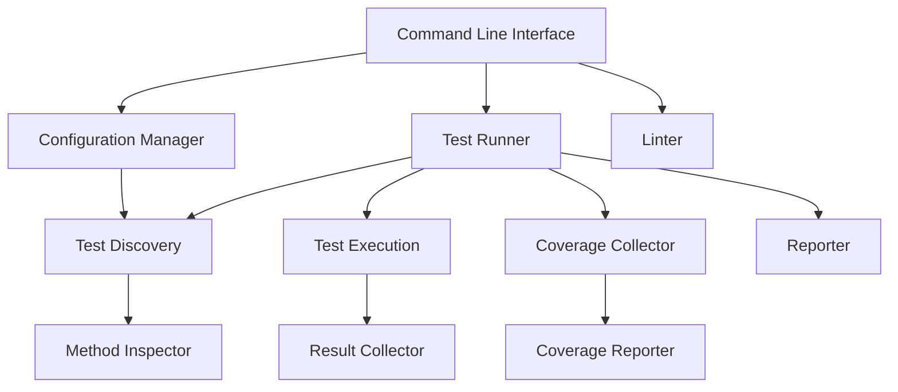

# Design Document: Lightweight Test Runner

## Overview

The Lightweight Test Runner is a simple, efficient Python testing framework that provides test discovery at the method level, code coverage reporting, and basic linting capabilities. This design document outlines the architecture, components, and implementation details for this lightweight solution.

The framework will focus on simplicity and ease of use while still providing detailed test results, including method-level test discovery and reporting for different test types (unit, integration, e2e, regression).

## Architecture

The Lightweight Test Runner will follow a simple, modular architecture with minimal dependencies. The main components will be:

1. **Test Discovery**: Responsible for finding test files and methods
2. **Test Execution**: Handles running tests and collecting results
3. **Reporting**: Generates and displays test results and coverage information
4. **Linting**: Performs code style checks
5. **Configuration**: Manages test groupings and settings

### Architecture Diagram



## Components and Interfaces

### Command Line Interface

The main entry point for the framework, handling command-line arguments and executing the appropriate actions.

```python
def main():
    """
    Main entry point for the test runner.
    
    Usage:
        python testrules.py [group|test_module1 test_module2 ...|lint|check|unit|integration|e2e|regression]
    """
    # Parse command-line arguments
    # Execute appropriate action based on arguments
```

### Configuration Manager

Handles loading and parsing the configuration file, with sensible defaults when no configuration is present.

```python
def load_config(config_file="testrules.json"):
    """
    Load configuration from a JSON file if present, else use defaults.
    
    Args:
        config_file: Path to the configuration file
        
    Returns:
        Dictionary containing configuration settings
    """
    # Load configuration from file if it exists
    # Otherwise, return default configuration
```

### Test Discovery

Responsible for finding test files and methods based on patterns and configuration.

```python
def discover_tests(test_type=None, modules=None, config=None):
    """
    Discover test files and methods.
    
    Args:
        test_type: Type of tests to discover (unit, integration, e2e, regression)
        modules: List of specific modules to test
        config: Configuration dictionary
        
    Returns:
        Dictionary mapping test modules to test methods
    """
    # Discover test files based on patterns
    # Inspect files to find test methods
    # Return mapping of modules to methods
```

### Method Inspector

Inspects test files to identify individual test methods.

```python
def inspect_module(module_name):
    """
    Inspect a module to find test methods.
    
    Args:
        module_name: Name of the module to inspect
        
    Returns:
        List of test methods in the module
    """
    # Import the module
    # Find unittest.TestCase classes
    # Identify test methods
    # Return list of test methods
```

### Test Execution

Handles running tests and collecting results.

```python
def run_tests(test_mapping, collect_coverage=True):
    """
    Run tests and collect results.
    
    Args:
        test_mapping: Dictionary mapping test modules to test methods
        collect_coverage: Whether to collect coverage information
        
    Returns:
        TestResult object containing test results
    """
    # Set up coverage collection if enabled
    # Run tests and collect results
    # Return test results
```

### Result Collector

Collects and organizes test results.

```python
class TestResult:
    """
    Container for test results.
    """
    def __init__(self):
        self.total = 0
        self.passed = 0
        self.failed = 0
        self.errors = []
        self.duration = 0
        self.method_results = []
```

### Reporter

Generates and displays test results.

```python
def report_results(results, verbose=False):
    """
    Report test results to the console.
    
    Args:
        results: TestResult object
        verbose: Whether to show detailed information
    """
    # Display summary statistics
    # Show failed tests if any
    # Display execution time
```

### Coverage Collector

Collects code coverage information during test execution.

```python
def start_coverage():
    """
    Start collecting coverage information.
    
    Returns:
        Coverage object
    """
    # Initialize coverage collection
    # Start collecting coverage
    # Return coverage object

def stop_coverage(cov):
    """
    Stop collecting coverage information and generate reports.
    
    Args:
        cov: Coverage object
    """
    # Stop collecting coverage
    # Generate reports
    # Display summary
```

### Linter

Performs code style checks using flake8.

```python
def run_lint():
    """
    Run PEP8 style checks using flake8.
    
    Returns:
        Number of style violations found
    """
    # Run flake8 checks
    # Return number of violations
```

## Data Models

### Test Method

```python
class TestMethod:
    """
    Represents a test method.
    """
    def __init__(self, name, module, class_name=None):
        self.name = name
        self.module = module
        self.class_name = class_name
        self.full_name = f"{module}.{class_name}.{name}" if class_name else f"{module}.{name}"
```

### Method Result

```python
class MethodResult:
    """
    Represents the result of executing a test method.
    """
    def __init__(self, method, status, duration, error=None, traceback=None):
        self.method = method
        self.status = status  # "pass", "fail", or "error"
        self.duration = duration
        self.error = error
        self.traceback = traceback
```

### Configuration

```python
class Config:
    """
    Configuration for the test runner.
    """
    def __init__(self, data=None):
        self.data = data or {}
        self.test_patterns = self.data.get("test_patterns", {
            "unit": ["test_*.py", "*_test.py"],
            "integration": ["integration_test_*.py", "*_integration_test.py"],
            "e2e": ["e2e_test_*.py", "*_e2e_test.py"],
            "regression": ["regression_test_*.py", "*_regression_test.py"]
        })
        self.test_groups = self.data.get("test_groups", {"all": []})
        self.coverage_enabled = self.data.get("coverage_enabled", True)
        self.html_coverage = self.data.get("html_coverage", True)
        self.html_coverage_dir = self.data.get("html_coverage_dir", "htmlcov")
```

## Implementation Details

### Test Discovery Process

1. Identify test files based on patterns or explicit module names
2. Import each module
3. Inspect the module to find unittest.TestCase classes and test methods
4. Create TestMethod objects for each test method
5. Organize test methods by module and test type

### Test Execution Process

1. Set up coverage collection if enabled
2. For each test module:
   - Import the module
   - For each test method:
     - Set up a test loader to load the specific method
     - Run the test and capture the result
     - Record execution time, status, and any errors
3. Stop coverage collection and generate reports
4. Return the collected results

### Reporting Process

1. Calculate summary statistics (total tests, passed, failed, success rate)
2. Display the summary in the console
3. Show details of any failed tests
4. Display coverage information if collected
5. Generate HTML coverage report if enabled

### Configuration File Format

The configuration file will use a simple JSON format:

```json
{
  "test_patterns": {
    "unit": ["test_*.py", "*_test.py"],
    "integration": ["integration_test_*.py", "*_integration_test.py"],
    "e2e": ["e2e_test_*.py", "*_e2e_test.py"],
    "regression": ["regression_test_*.py", "*_regression_test.py"],
    "custom_type": ["custom_*.py"]
  },
  "test_groups": {
    "all": ["test_module1", "test_module2"],
    "core": ["test_core_module1", "test_core_module2"],
    "api": ["test_api_module1", "test_api_module2"]
  },
  "coverage_enabled": true,
  "html_coverage": true,
  "html_coverage_dir": "htmlcov"
}
```

## Error Handling

The framework will implement simple but effective error handling:

1. **Module Import Errors**: If a test module cannot be imported, report the error and continue with other modules
2. **Test Execution Errors**: Capture exceptions during test execution and include them in the test results
3. **Configuration Errors**: If the configuration file is invalid, log an error and use default settings
4. **Coverage Errors**: If coverage collection fails, log an error and continue without coverage

## Dependencies

The framework will have minimal dependencies:

1. **unittest**: Standard library module for test execution
2. **coverage**: For code coverage collection and reporting
3. **flake8**: For code style checking
4. **importlib**: Standard library module for dynamic module importing
5. **json**: Standard library module for configuration file parsing

## Command Line Interface

The framework will support the following commands:

1. `python testrules.py [group]`: Run tests in the specified group
2. `python testrules.py [module1 module2 ...]`: Run tests in the specified modules
3. `python testrules.py unit`: Run all unit tests
4. `python testrules.py integration`: Run all integration tests
5. `python testrules.py e2e`: Run all end-to-end tests
6. `python testrules.py regression`: Run all regression tests
7. `python testrules.py lint`: Run only code style checks
8. `python testrules.py check`: Run both code style checks and all tests

## Output Format

The console output will be clear and informative:

```
🚀 Starting test run...

test_module1.TestClass.test_method_1 ... ok
test_module1.TestClass.test_method_2 ... FAIL
test_module2.test_function_1 ... ok
test_module2.test_function_2 ... ok

======================================================================
FAIL: test_module1.TestClass.test_method_2
----------------------------------------------------------------------
Traceback (most recent call last):
  File "test_module1.py", line 42, in test_method_2
    self.assertEqual(1, 2)
AssertionError: 1 != 2

🧪 TEST SUMMARY
✅ Passed:        3
❌ Failed:        1
📊 Total:         4
📈 Success Rate:  75.00%

📄 Coverage Report:
Name                 Stmts   Miss  Cover   Missing
--------------------------------------------------
module1.py              20      4    80%   24-27
module2.py              15      0   100%
--------------------------------------------------
TOTAL                   35      4    89%

📁 HTML report saved to: htmlcov/index.html

⚠️ Some tests failed. Please check above for details.
```

## Performance Considerations

To ensure good performance:

1. **Lazy Loading**: Only import test modules when needed
2. **Efficient Test Discovery**: Use file system operations efficiently to find test files
3. **Minimal Dependencies**: Keep dependencies to a minimum to reduce overhead
4. **Simple Data Structures**: Use simple, efficient data structures for storing and processing test results

## Extensibility

While focusing on simplicity, the framework will allow for some extensibility:

1. **Custom Test Types**: Support for defining custom test types through configuration
2. **Test Grouping**: Flexible test grouping through configuration
3. **Command-Line Options**: Support for various command-line options to customize behavior